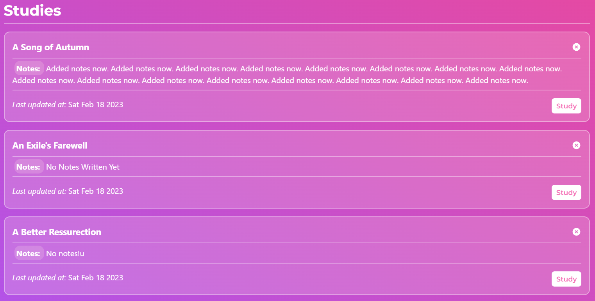

# [Poetry Dot](https://poetrydot.netlify.app)
----

## **The Inspiration**
> "Poetry is the spontaneous overflow of powerful feelings:
> It takes its origin from emotion recollected in tranquility...
> 
> By William Wordsworth"

## App Description
Poetry Dot is a web-app, where users can discover, browse or study from the collection of thousands of classic poetry, arranged under 130+ classical authors. 

PoetryDot is a micro-blogging web-app which allows users to share their thougths on the web app, get comments and likes from fellow users, and users have full control over their posts.
 
PoetryDot offers very intuitive and simple UI that allows users to navigate and performs action on the web app.
___

## Tech Stack Used
+ **NextJS ( ReactJS )**
+ **Tailwind CSS**
+ **React Query**
+ **AuthJS**
+ **MongoDB**

___

## Features
+ Poetry discovery, browsing and study, arranged under author pages.
+ Like, add to collection or study a poetry.
+ Authors page: filter authors by name, arranged alphabetically.
+ Post sharing, with features to like, comment(two levels of nesting), uploading image in the post.
+ Full control over the profile i.e. deletion, updation, addition.
+ Properly managed routes, which makes the links shareable.
___

## Overview of the app
1. **` Discover, Browse or Study `** poetry arranged under author's page.
2. **` Find authors `** from the list of all the authors stored in the database. Navigate to the _Authors_ page which is located in the _**navigation**_.
> The Navigation has two layers to it.
> + If the user is not signed in with any of the authentication providers, the primary links e.g. link to home page, link to authors page and the link to the sign in page is located directly on the navigation bar.
>
> 
> 
> + If the user is authenticated however, most of the links to the features that are only accessible to authenticated users, coule be accessed by hovering( or click on smaller devices) over the profile picture of the user.
> 
> 
> The Navigation sidebar has all the links that the user can make use of, and no elements except the search bar and the logo is placed on the navbar, to keep the navbar clean.
>
> 
1. When the user navigates to the **` authors page `**, a whole list of author names is presented, which are arranged alphabetically.
>
2. Currently we only have around 125+ authors poetry collection, and we are also missing many important works of many authors. We acknolwdge that, and we will add more with each iterations.
3. The authors page also has the filtre input box, where the user could type a name, and the matching names will be returned.
4. For example if the user tries to enter "adam", the result would be like the following, "Adam Lindsay Gordon" and "Sarah Flower Adams".
5. As I mentioned before, all the poetry works are arranged in a particular authors page.
6. So when a user clicks on a authors name in the _/authors_ page, the user is taken to the **` page of that exact author `**.
>
7. In that page, we can find the following elements,
   1.  The authors picture, extracted from Wikipedia.
   2.  The authors details paragraph, giving summary of his/her life, extracted from Wikipedia.
   3.  We also have a tagline, that speaks of the primary role of the author in his/her lifetime.
   4.  Below that, we can find the list of poetry written by the author.
   5.  
8.  Now when a user clicks on a poetry name, the user is taken to the **` page of that exact poetry `**.
>
9.  In the page of the poetry, the header and the poetry is presented in different font i.e Alegreya, than the font used in the site primarily to enhance the reader's experience.
10. Going donwn the page, the user can find three buttons, i.e Like, Add To Collection and Study.
>
11. The **` Like `** button is used to push it in the array of user's liked poems, which is used to view the list of poems in the user's profile.
    1.  If the user the poetry in his liked array already, a helpful message would be shown as a toaster in the bottom-center position.
12. When the user clicks on the **` Add To Collection `** button, a modal is opened, we have the following elements.
    1.  The user has the option to choose between the collection name to put that poetry in.
    2.  
    3.  Beneath that, user can also create a new collection by typing the name. If the user types anything in that field, a collection would be created corresponding to that value and the poetry would be added to it and a helpfull message would be shown.
    4.  And when the user tries to tries to add one more poetry to a collection, the collection's name that was just created would be available in the list.
    5. After that we have two button, Add and Cancel.
    6. The Add button would add the poetry to the respective collection and the cancel button would close the modal.
    7. One thing I would like to mention is that, when the user clicks on the Add button and the web app is making the database call in that moment, a small loader-spinner is shown inside of that button instead of the text "Add", aimed at better user experience, and after it is done, a toaster is shown, and the modal closes automatically.
    8. It's probably does not make much difference, but I believe the devil lies in the details.
    9. 
 13. When the user clicks on the **` Study `** button, the particular title is added to the study array of the user.
 14. Below these buttons, we have the section on details of the author.
     1.  The picture of the author
     2.  The name, the tagline of the array, and his/her summary.
     3.  A link to see more of his works
     4.  
 15. Moving on, after the title section and the author section, we come to the _**Comments**_.
> 
 16. Here all the authenticated user can add comments.
     1.  The comments are arranged in a descending order, means the newer comments will be shown first.
     2.  Here in every comment the following elements are presented.
     3.  The user's avatar, name, the date of creation of the comment and the comment content.
     4.  We do not have the feature to delete a comment as of yet.
 17. The Study is a very extensive feature of this app. The user can navigate to the study by clicking the link on the navigation sidebar.
 18. When the user clicks on the link, user is taken to the study page, where all the titles are shows that are added by the user.
> 
 19. Every title in the _**/studies**_, has it's own card, with the follwing elements.
     1.  The title name.
     2.  The notes belonging to that title study
     3.  On the top-right of the card, a _**XCross**_ icon could be found, when clicked, it deleted the particular title form the study list.
     4.  The date when the study was last updated.
     5.  Beside that the _**Study**_ button when it is clicked, the user is navigated to the study page of that title. 
 20. On that page, things are little different.
> 
 21. Here, beside every line of that title, an _**Icon**_, meant to edit the overview of that line is located.
     1.  When the user clicks on that button, a modal is opened.
     2.  Here the user is presented with the _**text of the line**_ and a input box where the user can put his/her own thoughts.
     3.  Below that, we have two buttons, e.g. _**Add & Close**_ and _**Cancel**_.
     4.  
     5.  When the user clicks on the former, the comment on the line is updated and the modal is closed, and the latter just closes the modal without updating the comment.
 22. Below all these, we can find the Notes section, where the user can add extensive notes on that particular.
> 
 23. All the content updated on the current study session will be not saved unless the user clicks on the _**Save**_ button presented on the bottom of the page.
 24. If the user tries to Reload the page, or tries to navigate to another link without saving the content, an alert is shown, mentioned the same.
 25. Also that the app had been designed with the mobile-first approach in mind from scratch, so the web-app is fully responsive.

### User Posts
When I first started building the app, the stretch of idea of the app in my mind was only to build a poetry app, where users can come by and enjoy the beauty of poetry. At the end though, with everything set-up in place, it still felt like something was missing.

> **Art doesn't happen in isolation, it is always influenced.**

While reading or writing poetry, we always get the desire to share the experience to other people, and what's better than people who also like poetry?

That's how I decided to turn PoetryDot into a micro-blogging webstire, where authenticated users can share their thoughts.

### The flow
1. When a user is authenticated and navigates to the homepage, the user is shown posts other users have made.
2. If the user is not authenticated, the user is taken to the _**/landing**_ page, where we advertise PoetryDot, there on the user can signin and explore.
> 
3. When the user clicks on the user card in the navigation sidebar, the user is taken to his/her **` profile page `**.
4. In the profile page, all the user preferences are shown.
   1. On top the user info is shown including the user's picture, name, email, bio and the personal website.
   2. 
   3. In the user info card, we also have a _**Edit Profile**_ button, when clicked, it open up the user info updation modal.
   4. Here the user can chage their bio and add their personal website.
   5. Beneath the user info card, we have three tabs as the following, **`Posts`**, **`Liked Poems`**, **`Collections`**.
   6. 
   7. The posts tab shows all the posts made by the user, the liked poems tab lists down all the poems the user has liked, and the collection tab lists down all the collection.
   8. 
   9. As mentioned before, the user has total control over their content and preferences, so if user wants, they can delete a post, delete liked poems, and also delete poems inside of a particular collection or delete a collection altogether.
   10. On the posts tab, first we come across the **` New Post `** tile, where the user can directly type the post body, and when clicked on the **` Post `** button, the **` New Post `** modal is opened.
   11. 
   12. Here the user can include the post title and also add a image to better illustrated the post.
   13. After that the user can upload the post or cancel it.
   14. When clicked on the **` Post `** button inside of the new post modal, the post is uploaded, and the loader-spinner is shown inside of the button, and the page is reloaded on successful upload.
   15. User's cannot upload posts with the title that already exists.
5. Back to the homepage,where all the user posts are shown, a user can click on a post's author's name and it will naviagte to the author's profile page.
6. Every post has the following actions available,
   1. 
   2. Like, a user can like a post.
   3. Comment. Users can comment on a post.
   4. We also have the feature of nested comments, meaning users can comment to another comment, though the level of nesting is limited to two only.
   5. When the user clicks on the title of post, the user is taken to the particular post's page.
7. Finially it is worth mentioning that, all the routes are configured in a way that the link is easily shareable, and the link would correspond to the exact content.
___
## Environmental Variables Used
- GOOGLE_CLIENT_ID: Google client ID for user authentication, can be obtained from google console
- GOOGLE_SECRET: Google secret for user authentication, can be obtained from google console
- GITHUB_CLIENT_ID: Github client ID for user authentication, this can be obtainer from `https://github.com/settings/applications/new`, you would need to register a new application.
- GITHUB_SECRET: Github secret for user authentication, can be obtained post registration of the application of the app
- DB_URL: The mongodb cloud database url. Here I have used `MongoDB Atlas`, other products could also be used if desired, make sure the admin user is created and the user name and password is included in the connection string.
___
## Knows Technical / UI Bugs
- [ ] ADD: Add skeleton loaders to other pages.
- [ ] ADD: Add request new title feature
- [ ] ADD: Add an **` /about `** page.